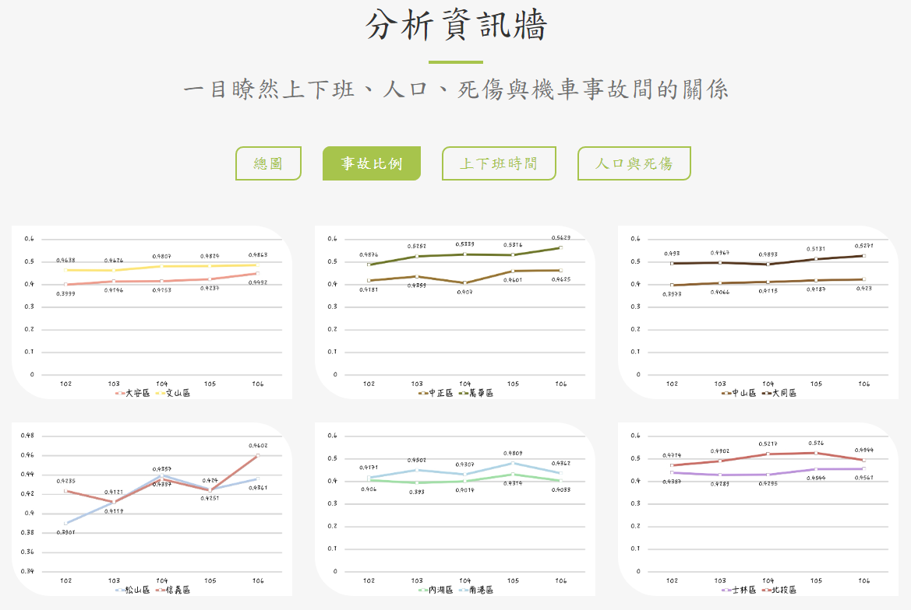

# Visualize-Locomotive-Traffic-Accident-Analysis
這是由一個五人的團體所完成的網站
此網站以分析機車交通事故為主題，將分析結果以視覺化的方式放入網頁中，並自行做編排。
這個網站於2018年完成，因此分析的年份為2013-2017。

## 網頁介紹
- 發想(動機) 
- 分析資訊牆
- 分析總結
- 互動式圖表
- 結論 
- Infographic
- 實際操作

**發想(動機)** 

網頁在封面之後，我們首先提出了這個網頁的主題發想，並搭配下圖的1-4的順序，依序介紹了我們這個團體的成員；分別有幾位是機車族或是搭乘運輸工具的通勤族；我們時常收到的長輩關心訊息以及針對交通事故的分析項目列了出來。

**分析資訊牆** 

接著分析資訊牆針對上下班、人口、死傷與機車事故之間的關係，做了多種樣式的分析圖。
以下分別列出"總圖"、"事故比例"、"上下班時間"及"人口與死傷"的分類結果。

**分析總結** 

分析總結的部份我們統計了多種與交通事故有關的指標進行分析，在下圖中有六個類別的分析結果，右側皆有加上圖表的敘述，以及下方有可以點開互動式圖表的按鈕。

**互動式圖表** 

此處我們嵌入了infogram這個程式來呈現互動式的圖表，我們可以透過點擊下方的分類決定是否讓這個類別出現在圖表的統計上。

**結論** 

此處我們搭配一些政府的政策去分析交通事故的一個結論

**Infographic**

另外我們有自製一份infographic去簡單的概括我們整個主題的內容與項目。

**實際操作**

最後我們有嵌入tableau這個程式將我們所有分析的結果做一個總表及互動，讓大家可以根據不同年份的資料，去選擇不同的客群，同時了解到交通事故在各個時段發生的案件量統計、針對不同性別與年齡層的分析。

